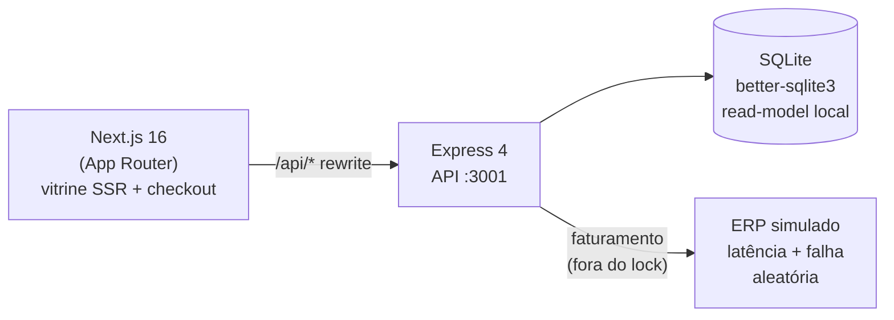
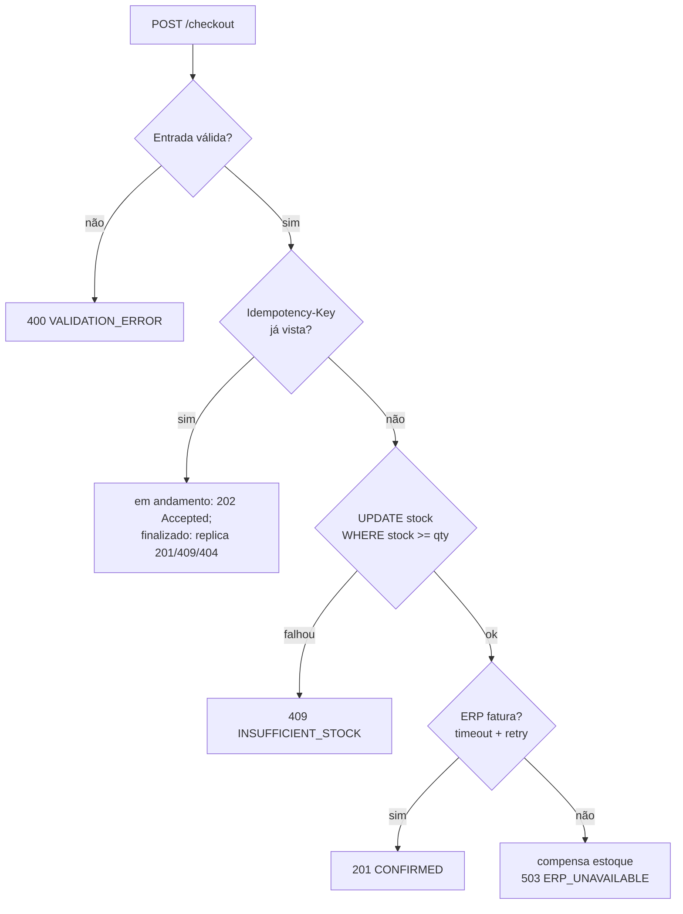

# CaseCellShop — Mini-checkout

Mini-projeto fullstack de checkout de capinhas. Trata sucesso, validação, estoque insuficiente, pedido duplicado e falha temporária do ERP — sem vender além do estoque.

## Pré-requisitos

- **Node 20+** (testado em Node 26). Sem Docker, sem MySQL, sem cloud.

## Como rodar

```bash
npm install        # na raiz — instala backend + frontend
npm run dev        # sobe API em :3001 e front em :3000 juntos
```

Acesse **http://localhost:3000**. O SQLite é criado e semeado automaticamente no primeiro boot.

> A app funciona sem nenhum `.env`. Consulte `.env.example` para ver os knobs disponíveis
> (porta, caminhos, comportamento do ERP simulado).

## Como testar

```bash
npm test           # roda os 34 testes de backend + 3 de frontend
```

---

## Arquitetura



O front-end não faz chamadas diretas ao backend — o Next.js proxeia `/api/*` via `rewrites` (em `next.config.mjs`), eliminando CORS. Produtos são buscados no servidor (Server Component + `force-dynamic`) para refletir estoque atual a cada requisição.

### Fluxo do checkout (reservar → faturar → compensar)



---

## Decisões técnicas → problemas

| Problema | Decisão |
|---|---|
| **P01 — Vitrine lenta** | Lê do read-model SQLite local (rápido, sem JOIN pesado) + SSR no Next — a loja renderiza no servidor com os dados frescos. |
| **P02 — Overselling** | Reserva atômica: `UPDATE products SET stock = stock - :q WHERE id = :id AND stock >= :q`. O banco rejeita atomicamente se estoque insuficiente — sem race condition. |
| **P03 — Resiliência** | Chamada ao ERP **fora** da seção crítica (após o UPDATE). Timeout por tentativa + retry limitado a erros transitórios. Compensação atômica do estoque na falha. |
| **Pedido duplicado** | `INSERT` em coluna `idempotency_key UNIQUE` — o banco arbitra, sem check-then-insert. Cliente gera uma chave por tentativa; o desfecho é replicado. Falhas transitórias do ERP **liberam** a idempotency-key (não são cacheadas), permitindo retry com a mesma chave (estilo Stripe). |
| **Stack** | Express: minimalista e amplamente adotado, sem abstrações que escondam o fluxo; Next.js (App Router): SSR nativo para a vitrine; **better-sqlite3 ^12**: binários pré-compilados para Node 20–26 — sem build nativo nem Docker, roda em qualquer máquina. |

---

## Como testar cada cenário

A UI tem um seletor **"Simular ERP"**. Na API use o header `x-erp-scenario: success|slow|fail`.

| Cenário | Ação na UI | Curl | Status esperado |
|---|---|---|---|
| Sucesso | Seletor "sempre sucesso" → Comprar qualquer produto em estoque | `curl -s -XPOST http://localhost:3001/checkout -H 'Content-Type: application/json' -H 'Idempotency-Key: k1' -H 'x-erp-scenario: success' -d '{"productId":"capa-silicone-preta","quantity":1}'` | **201** `CONFIRMED` |
| Validação (qty inválida) | quantidade 0 ou texto | `curl -s -XPOST http://localhost:3001/checkout -H 'Content-Type: application/json' -H 'Idempotency-Key: k2' -d '{"productId":"capa-silicone-preta","quantity":0}'` | **400** `VALIDATION_ERROR` |
| Estoque insuficiente | `capa-couro-vintage` (estoque 0) ou qty > estoque | `curl -s -XPOST http://localhost:3001/checkout -H 'Content-Type: application/json' -H 'Idempotency-Key: k3' -H 'x-erp-scenario: success' -d '{"productId":"capa-couro-vintage","quantity":1}'` | **409** `INSUFFICIENT_STOCK` |
| Falha temporária do ERP | Seletor "sempre falha" → Comprar | `curl -s -XPOST http://localhost:3001/checkout -H 'Content-Type: application/json' -H 'Idempotency-Key: k4' -H 'x-erp-scenario: fail' -d '{"productId":"capa-silicone-preta","quantity":1}'` | **503** `ERP_UNAVAILABLE` (estoque devolvido) |
| Pedido duplicado | Clicar "Comprar" duas vezes rápido (mesma key gerada pelo front) | Repetir o curl com a **mesma** `Idempotency-Key` usada no sucesso | Mesmo desfecho, estoque não decrementa duas vezes |

### Consultar status do pedido

```bash
GET /orders/:id
```

Retorna o estado atual: `PROCESSING` → `CONFIRMED` ou `FAILED`.

---

## Produtos seedados

| ID | Nome | Preço | Estoque inicial |
|---|---|---|---|
| `capa-silicone-preta` | Capa de Silicone Preta | R$ 49,90 | 25 |
| `capa-transparente-antishock` | Capa Transparente Anti-Shock | R$ 69,90 | 5 |
| `capa-couro-vintage` | Capa de Couro Vintage | R$ 129,90 | 0 |

---

## Resetar o banco

O banco é um único arquivo SQLite em `backend/data/casecellshop.sqlite` (os arquivos `-shm` e `-wal` ao lado são auxiliares do modo WAL). O seed só insere os 3 produtos **se a tabela `products` estiver vazia** (`seedIfEmpty`), e isso roda no boot da API. Logo: esvaziar os produtos e reiniciar devolve o estado de fábrica.

**Reset total** (produtos + pedidos + idempotência) — recomendado para dev:

```bash
# 1. pare o npm run dev (Ctrl+C)
rm backend/data/casecellshop.sqlite*   # apaga o banco e os auxiliares -shm/-wal
npm run dev                            # o boot recria o schema e re-semeia os 3 produtos
```

**Só os produtos**, mantendo pedidos e o arquivo:

```bash
# com o servidor parado:
sqlite3 backend/data/casecellshop.sqlite "DELETE FROM products;"
npm run dev   # seedIfEmpty re-insere os 3 produtos
```

> Pare a API antes de apagar/limpar o banco — o processo mantém o arquivo aberto. E se já houver pedidos, prefira o reset total: a tabela `orders` referencia `products`, então apagar só os produtos deixaria pedidos apontando para produtos inexistentes.

---

## Limitações conhecidas

- **Vazamento de estoque (stock leak):** se o processo cair entre a reserva do estoque e a compensação em caso de falha do ERP, o estoque fica preso. Mitigação real: sweeper com TTL sobre reservas pendentes.
- Dados em SQLite local; sem sincronização real com um ERP externo.
- **Timeout não cancela a chamada ao ERP (cenário `slow`):** o timeout por tentativa responde rápido ao cliente, mas a chamada lenta ao ERP segue executando em segundo plano até terminar sozinha — não há cancelamento.

  *Exemplo* (com `ERP_TIMEOUT_MS=1500` e o ERP levando ~16s no cenário `slow`):
  1. `t=0s` — cliente faz `POST /checkout`; o estoque é **reservado**.
  2. `t=1,5s` — o timeout dispara → o cliente recebe **503** e o estoque é **compensado** (devolvido). Do ponto de vista do cliente e do estoque, está tudo coerente.
  3. `t=16s` — a chamada ao ERP, **que não foi cancelada**, resolve "sozinha", sem ninguém aguardando por ela. Num ERP real isso poderia significar um faturamento gerado *depois* de o cliente já ter desistido (um "faturamento fantasma"), além de timers acumulados sob carga de muitas requisições lentas.

  Como o ERP aqui é **simulado** (o `delay` não comete efeito externo, só retornaria um `invoiceId`), **não há impacto funcional** na entrega — é uma questão de higiene de recurso/realismo. A correção de produção é cancelar a requisição (ver Próximos passos).

## Próximos passos

- **Checkout assíncrono:** aceitar o pedido com `202 Accepted` e processar em background; o cliente faz polling em `GET /orders/:id` — desacopla totalmente da latência do ERP.
- Sweeper de reservas com TTL para fechar o stock leak.
- **Cancelamento de requisição (`AbortController`) + circuit breaker** no cliente do ERP: hoje o timeout responde rápido, mas não cancela a chamada lenta no upstream (ver Limitações → cenário `slow`). Cancelar evita trabalho desperdiçado e o "faturamento fantasma"; o circuit breaker evita martelar um ERP já degradado. OpenAPI quando virar produto.

---

## Processo de desenvolvimento

Fluxo **spec-driven**, com revisão a cada etapa:

1. **Spec primeiro.** Escopo, os 3 problemas e as decisões de arquitetura definidos antes de escrever código.
2. **Plano em tarefas verificáveis** (TDD), arquivo por arquivo.
3. **Implementação com revisão por etapa** — conformidade com o spec + qualidade de código.
4. **Code review final** do diff, com correções verificadas por testes.

As decisões técnicas e o raciocínio estão em [`PROMPTS.md`](./PROMPTS.md).

---

## Estrutura

```
├── backend/      Express + SQLite + ERP simulado (estoque, idempotência, resiliência)
├── frontend/     Next.js 16 (vitrine SSR + checkout client)
├── package.json  npm workspaces — npm run dev | npm test | npm run build
└── .env.example  Knobs disponíveis (app roda sem este arquivo)
```

## Endpoints (backend :3001)

| Método | Rota | Descrição |
|---|---|---|
| `GET` | `/health` | Liveness + check do SQLite |
| `GET` | `/products` | Lista todos os produtos |
| `GET` | `/products/:id` | Detalhe de um produto |
| `POST` | `/checkout` | Cria pedido (headers: `Idempotency-Key`, `x-erp-scenario`) |
| `GET` | `/orders/:id` | Consulta estado de um pedido |

Envelope de erro: `{ error: { code, message, details? }, requestId }`.
